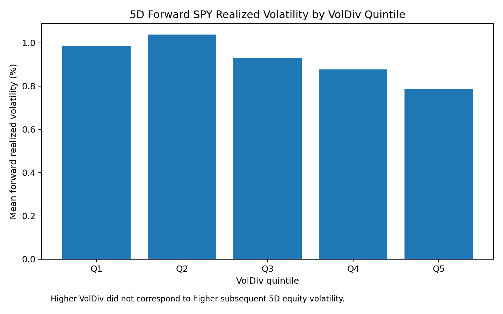
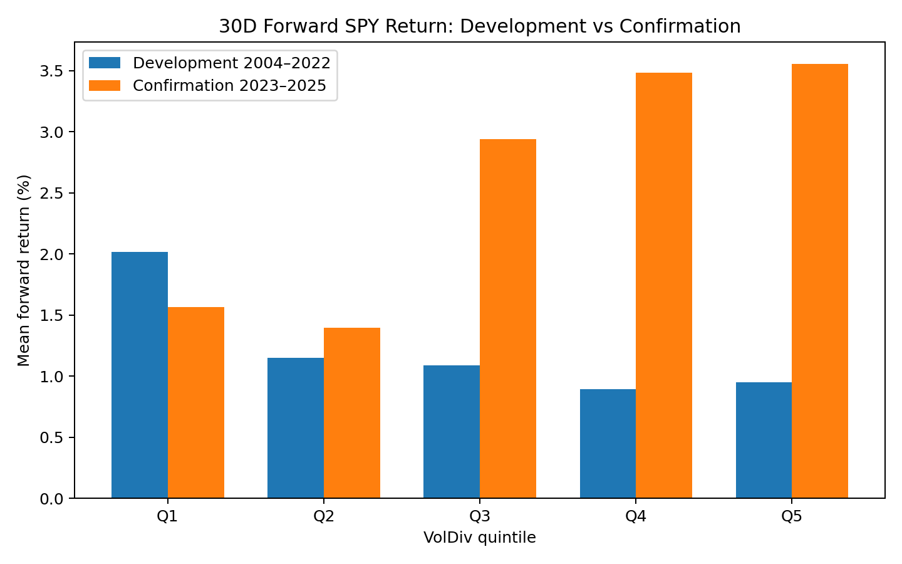
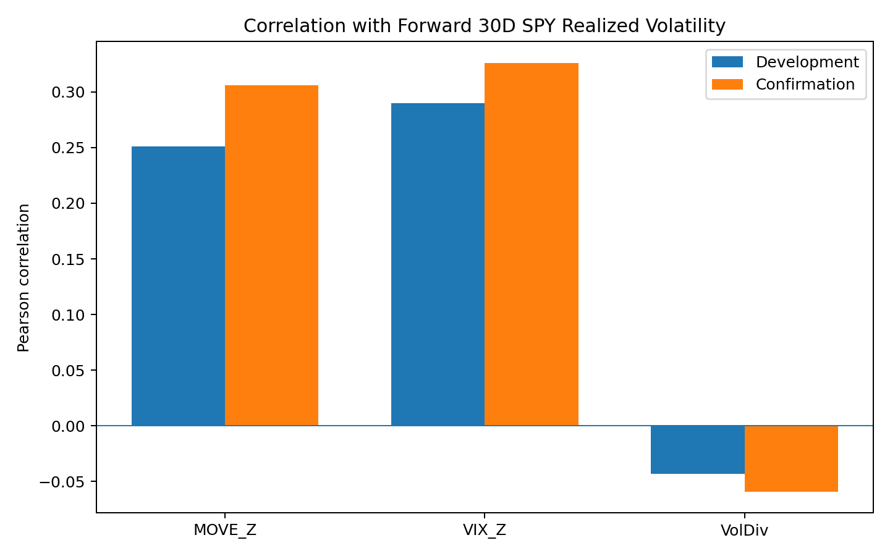
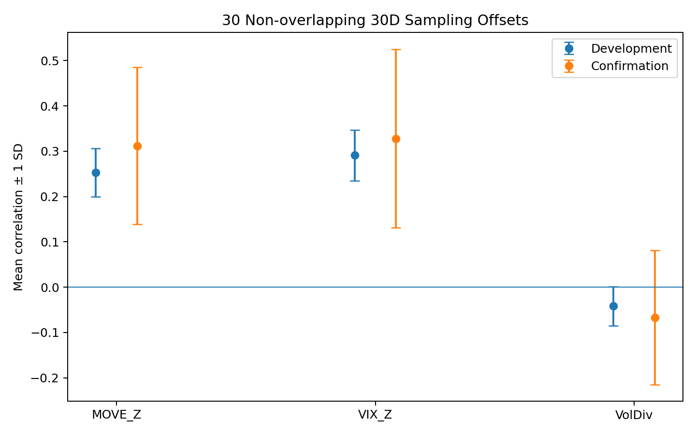

# Bond–Equity Volatility Divergence

### Does stress in the Treasury market lead equity-market risk?

This project tests whether unusually high Treasury-market volatility relative to equity volatility contains information about subsequent S&P 500 risk.

The motivating idea is intuitive: if Treasury volatility rises sharply while equity volatility remains subdued, the bond market may be repricing risk before equities fully reflect it. I test that idea using MOVE, VIX, and SPY observations from 2004–2026.

## Research design

The proposed point-in-time feature is:

**VolDiv(t) = Z_prior60(MOVE_t) − Z_prior60(VIX_t)**

Each z-score compares the current observation with the **prior 60 observations only**. The current observation is excluded from the rolling mean and standard deviation.

The original study examines 1-, 3-, and 5-trading-day forward outcomes. A 30-trading-day extension was specified before inspecting its outcomes to test whether Treasury-to-equity transmission might operate over several weeks.

For the 30D study:

- **Development:** 2004–2022
- **Confirmation:** 2023–2025
- **2026:** treated as a live case-study period rather than untouched out-of-sample evidence
- Quintile boundaries are learned from the development period and then frozen for confirmation.

## Key finding

**The original contagion hypothesis is not supported.**

High VolDiv did not consistently predict higher subsequent SPY risk at either short or 30-trading-day horizons.

At 5D, mean forward realized volatility actually fell from **0.986% in Q1 to 0.786% in Q5**.



## Development can mislead

For the 30D return label, the development sample initially looked consistent with the hypothesis: mean return declined from **2.015% in Q1 to 0.950% in Q5**.

But the confirmation period reversed the relationship: Q5 produced a mean 30D return of **3.555%**, versus **1.565% in Q1**.



This is why the development/confirmation split matters: a plausible in-sample relationship was not stable in later data.

## Component attribution

The most useful diagnostic came from separating the proposed feature back into its components.

| Correlation with forward 30D SPY realized volatility | Development | Confirmation |
|---|---:|---:|
| MOVE_Z | +0.251 | +0.306 |
| VIX_Z | +0.290 | +0.326 |
| VolDiv | -0.043 | -0.059 |



MOVE and VIX individually contained positive information about subsequent SPY realized volatility, while subtracting the two largely removed that relationship.

This is an important feature-engineering lesson: **a compelling economic narrative does not guarantee a useful composite feature. Feature engineering can destroy information as easily as it can create it.**

## Overlapping-label robustness

A 30D forward label creates severe overlap: adjacent observations share 29 of 30 future trading days. Therefore, the raw dataframe row count substantially overstates the number of independent future windows.

I tested all 30 possible non-overlapping sampling offsets.

| Positive-correlation offsets | Development | Confirmation |
|---|---:|---:|
| MOVE_Z | 30 / 30 | 30 / 30 |
| VIX_Z | 30 / 30 | 30 / 30 |
| VolDiv | 7 / 30 | 8 / 30 |



The direction of the MOVE and VIX component relationships survived all non-overlapping offsets. The magnitude is much less certain—especially in the confirmation period, where each offset contains only about 25 observations.

## What the failed signal may still be good for

The largest VolDiv observations cluster around unusual Treasury-market episodes, including dates associated with the 2009 post-crisis Treasury repricing, the 2013 taper-tantrum period, the October 2014 Treasury flash-rally episode, the post-2016-election reflation trade, and 2021 rate-repricing episodes.

That suggests a different use case:

> **VolDiv may be more useful as a cross-asset dislocation detector than as a directional SPY-risk predictor.**

This is a descriptive follow-up observation, not a validated predictive claim.

## Research lessons

- Economic intuition should generate hypotheses, not conclusions.
- Point-in-time feature construction matters.
- Development-sample relationships can reverse in confirmation data.
- Composite features can discard information contained in their components.
- Forward-looking labels can create substantial observation overlap.
- Dataframe row count is not the same thing as effective sample size.
- A failed predictive feature may still be useful for anomaly or regime detection.
- Negative results are useful when the research process is disciplined and reproducible.

## Next research question

POC01 generated a new, explicitly post-hoc hypothesis:

> **Does Treasury volatility contain incremental information about future equity realized volatility after controlling for VIX?**

That question belongs in a separate study rather than being used to rescue the original hypothesis.

## Repository structure

```text
.
├── README.md
├── notebooks/
│   └── 01_bond_equity_volatility_divergence.ipynb
├── figures/
│   ├── 01_voldiv_5d_realized_volatility.png
│   ├── 02_30d_return_dev_vs_confirmation.png
│   ├── 03_component_attribution.png
│   └── 04_nonoverlap_offset_robustness.png
├── data/
│   └── README.md
├── requirements.txt
├── .gitignore
└── LICENSE
```

## Data and reproducibility

The notebook downloads SPY, VIX, and MOVE through `yfinance` at runtime. No raw market-data file is committed to this repository.

Run the notebook top-to-bottom in a fresh environment. Because upstream market-data providers can revise historical observations, exact values may change slightly over time.

## Limitations

This is an exploratory quantitative research project, not a trading strategy or causal study. Pearson correlation does not establish causality. The 30D labels overlap heavily in the full sample; non-overlapping offset checks reduce that issue but substantially reduce sample size. Historical episode labels are descriptive context and are not used as predictive features.

## Disclaimer

For research and educational purposes only. Nothing in this repository is investment advice.
